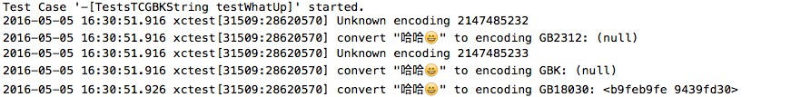

# why
gbk encoding is not available

# how
create gbk string by drop 4 byte code unit in gb18030 bytes

[gbk](https://zh.wikipedia.org/wiki/%E6%B1%89%E5%AD%97%E5%86%85%E7%A0%81%E6%89%A9%E5%B1%95%E8%A7%84%E8%8C%83), [gb18030](https://zh.wikipedia.org/wiki/GB_18030)

# more 
check the code
